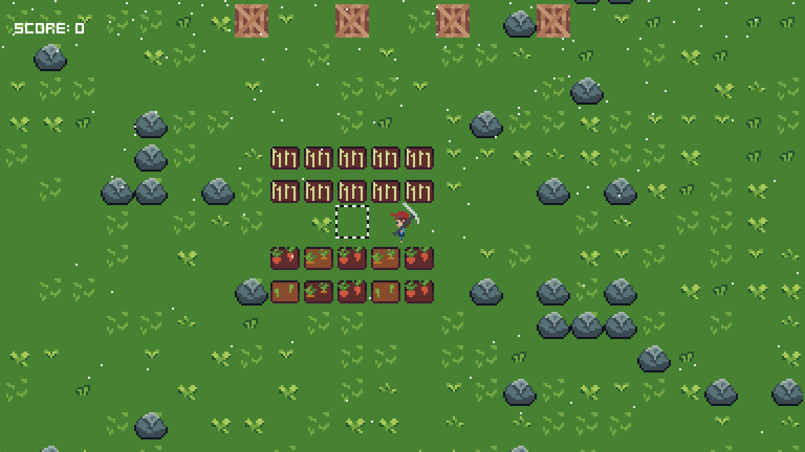

<!-- PROJECT SHIELDS -->
[![Contributors][contributors-shield]][contributors-url]
[![Forks][forks-shield]][forks-url]
[![Stargazers][stars-shield]][stars-url]
[![Issues][issues-shield]][issues-url]
[![MIT License][license-shield]][license-url]

 

  

  <h1 align="center">Unstable Farming</h1>

  

    A small puzzle game made in 48 hours for <a href="https://ldjam.com/events/ludum-dare/49">Ludum Dare 49</a>.
     
    <a href="https://digitea.itch.io/unstable-farming"><strong>Play the game »</strong></a>
     
     
    <a href="https://ldjam.com/events/ludum-dare/49/unstable-farming">View Entry</a>
    ·
    <a href="https://github.com/95jonpet/ld49/issues">Report Bug</a>
  

The weather is unstable, but the farm must be run.

Controls
Move with <kbd>W</kbd>, <kbd>A</kbd>, <kbd>S</kbd> and <kbd>D</kbd>.
Cycle items with <kbd>E</kbd> and <kbd>Q</kbd>.
Use items with <kbd>F</kbd> or <kbd>SPACE</kbd>.

This game was made by Peter Jonsson in 48 hours using [Godot](https://godotengine.org/).

## Screenshots

This is what the game looks like:

  
   
  

## License

Distributed under the MIT License. See `LICENSE.md` for more information.

<!-- MARKDOWN LINKS & IMAGES -->
<!-- https://www.markdownguide.org/basic-syntax/#reference-style-links -->
[contributors-shield]: https://img.shields.io/github/contributors/95jonpet/ld49.svg?style=for-the-badge
[contributors-url]: https://github.com/95jonpet/ld49/graphs/contributors
[forks-shield]: https://img.shields.io/github/forks/95jonpet/ld49.svg?style=for-the-badge
[forks-url]: https://github.com/95jonpet/ld49/network/members
[stars-shield]: https://img.shields.io/github/stars/95jonpet/ld49.svg?style=for-the-badge
[stars-url]: https://github.com/95jonpet/ld49/stargazers
[issues-shield]: https://img.shields.io/github/issues/95jonpet/ld49.svg?style=for-the-badge
[issues-url]: https://github.com/95jonpet/ld49/issues
[license-shield]: https://img.shields.io/github/license/95jonpet/ld49.svg?style=for-the-badge
[license-url]: https://github.com/95jonpet/ld49/blob/master/LICENSE.txt
[linkedin-shield]: https://img.shields.io/badge/-LinkedIn-black.svg?style=for-the-badge&logo=linkedin&colorB=555